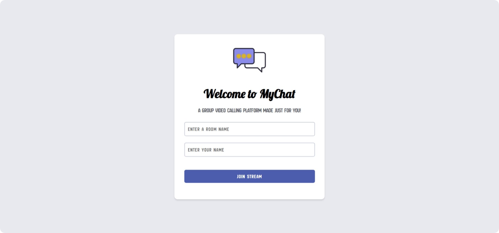

# VIDEO CHAT WEB APPLICATION

    <em>
        The web video chat application serves as a foundational simulation designed to provide essential virtual communication capabilities. Users can effortlessly enter virtual rooms and engage in straightforward, real-time conversations using their webcam and microphone. This basic simulation ensures clear and reliable video and audio quality, facilitating smooth interactions. While it offers a simplified model of video chat functionality, it effectively showcases key features, making it an excellent tool for understanding and experimenting with fundamental communication elements in an intuitive and accessible format.
    </em>

